## Introduction {#introduction}
---

When events occur in batches, a wave of webhooks may overwhelm consumers, resulting in dropped data. Always-on systems must be provisioned to handle worst-case scenarios, however, this is inefficient as these resources will be idling most of the time. What is needed is an efficient and easily deployable architecture for consuming webhooks at scale.

Nami provides a simple interface for deploying this type of architecture to consume webhooks. It relies on the elastic scaling power of AWS Lambda Function as a Service (FaaS) to handle bursty webhook traffic. The framework abstracts away the complexities of cloud infrastructure and the effort required to deploy, configure, and choreograph all of the services that make up the Nami architecture.

 

## Event-Driven Architecture {#eda}
---

Webhooks represent an event-driven approach to development. They allow applications to take in data about events as they happen, trading control of data flow for event-driven updates and asynchronicity. Nami’s event-driven architecture embraces this trade-off.

Since the introduction of web communication protocols like HTTP in the 1980s, the dominant paradigm for communication between systems is a client-server request-driven architecture where a client, or many clients, make a request to a server. The client’s request may either be getting information from the server, or updating information on the server. In either case, the server returns a response acknowledging the request, optionally including data that the client requested. This request-response process is a synchronous method of communication in that the client must wait for the server to return a response before continuing execution.

In an event-driven architecture (EDA), events represent changes in state that have already occurred. “An event is an object or message that indicates something has happened;” it holds information about that happening, but does not contain any logic itself (1). Rather than requesting for work to be done, the consumer responds to events that are announced after they have occurred. The EDA paradigm is asynchronous in that a caller is never sitting idle, waiting for a response to be returned. In an asynchronous, event-driven model, the dichotomy of client and server loses the meaning it has in the request-driven context, so we can instead use terms such as event producer (server sending the event notification) and event consumer (server receiving the event notification).

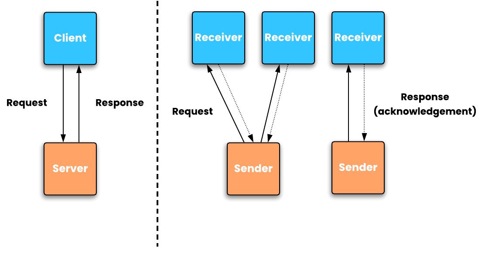

The contrast between request-driven and event-driven can be described in terms of the difference between *commands* and *events*. A command is initiated by the user, then must be validated as executable by the application, and only becomes a factual event upon successful execution. Unlike an application receiving a *command*, the consumer of an *event* cannot reject its validity; in other words, the producer does not know or care what the consumer thinks. While validation of a command needs to happen synchronously, an event consumer may consume the event asynchronously. The application producing the event needs to know nothing about the consumer(s) or how they will process the event. The producer only waits for acknowledgement that the message was received, but does not wait for the message to be processed (2).

While a request-driven architecture couples sender and receiver temporally, functionally, and by location, decoupling these attributes with EDA is one of its primary advantages. Decoupling between event producers and event consumers, often hosted on different servers, allows each to be implemented with different technologies, announce and process events at different times, and to be scaled separately, all without needing to know about one another’s implementation or whereabouts. The only thing producer and consumer need to agree on is the event definition itself (1).

 

## Webhooks {#webhooks}
---

One way that the shift towards an event-driven paradigm manifests is in the use of webhooks. Webhooks are a mechanism for one system to notify another system of an event that has occurred.

Before webhooks became a popular way to move data, polling techniques were commonly used to retrieve event information from services. If your app needed information from a service, it would need to continually poll that service with HTTP requests at a certain time interval to check for updated information.

*Polling an API for data*
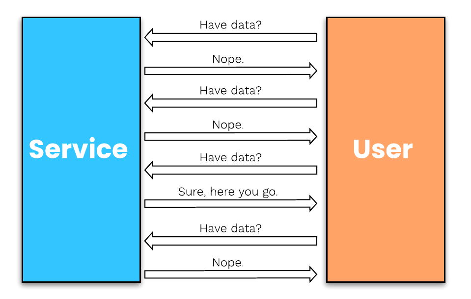

If that service does not have any updates, the resources used to continually poll the service were wasted. Webhooks turn this situation around: “don’t call us, we’ll call you.”

When a particular event occurs and triggers a webhook, the producer, or webhook sender, calls the receiver by making an HTTP request to the URL configured for the webhook subscription.

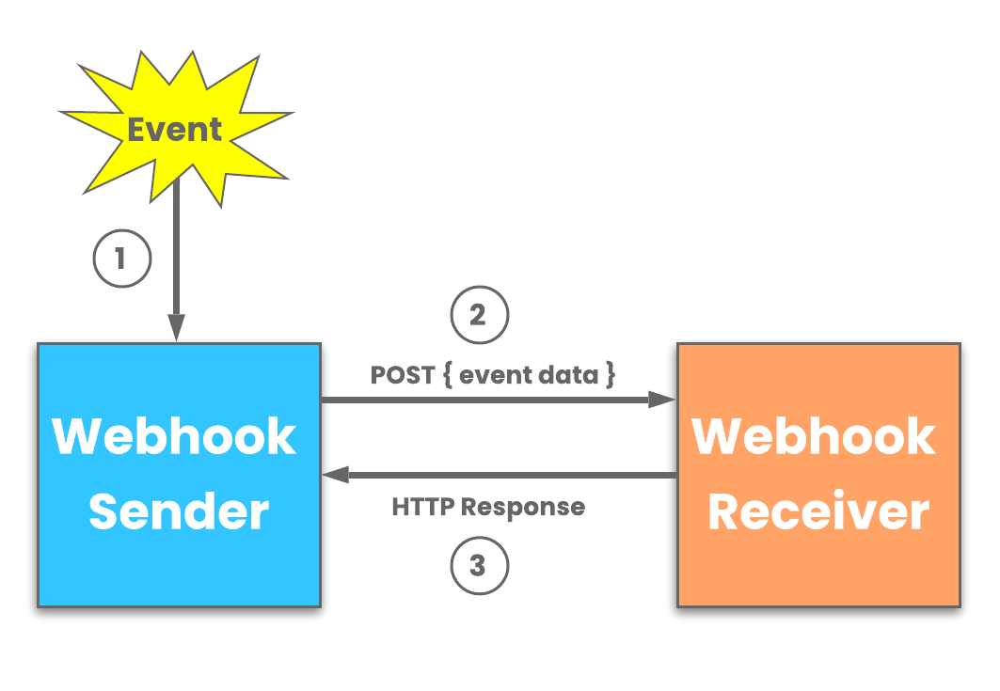

Webhook data is most commonly sent via a POST request, with the payload included in the request body. Webhooks can be sent as several different content types, including JSON, form-data, and XML. Once the request is received by the webhook consumer, a 200 status response is sent back to the webhook producer to let them know that the API endpoint is still listening and the message was successfully received.

Example webhook payload for Shopify *inventory item created* event
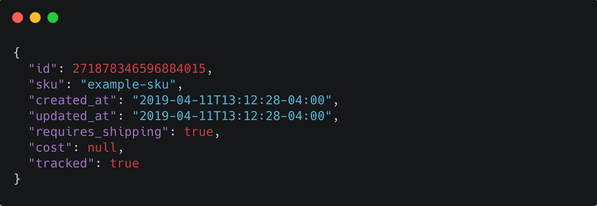

A common use case for Webhooks is for real-time event notification. Systems that generate a lot of events can quickly ramp up the webhook traffic to the destination. If webhook traffic grows consistently it is relatively easy to accommodate the extra load with additional infrastructure. More difficult though, is inconsistent, bursty traffic.

 

### Manual Solution
---

To handle these occasional spikes in traffic, the webhook consumer app could provision additional infrastructure to handle the extra traffic. However, there are a few drawbacks to this approach. Servers are expensive and require ongoing maintenance. This also makes the core application, sharing the same infrastructure, more vulnerable to downtime caused by problems with handling webhooks. Further, provisioning infrastructure that will sit idle and unused much of the time is an inefficient use of resources, especially for consumers receiving webhooks in volatile patterns.

Additionally, by nature of being event driven, the consumer cannot control the flow of data. If the flow of a webhook comes in like a firehose and generates more traffic than the application can handle, the result will be an unintentional denial-of-service (DoS) attack. This is like a crowd of people blocking the entry door of a business, making it more difficult for legitimate customers to enter, or denying them service (9).

Considering the challenges with using on-premise infrastructure to handle webhooks at scale, these types of use cases fit well with auto-scaling compute services like AWS Lambda, AWS’ Function as a Service (FaaS) platform. The elastic scaling capability of Lambda allows for compute resources to scale up and down on demand.

 

## Serverless Computing | FaaS {#serverless}
---

Before we examine AWS Lambda more closely, let’s take a step back and look at serverless as a whole.

Server management options run a continuum from bare metal (physical, on-site servers) to completely serverless. Serverless computing (comprised of both FaaS and Backend as a Service [BaaS]), which is in fact performed on servers somewhere, is on one end of the spectrum where all **provisioning and management concerns are abstracted away from the user**, but the tradeoff is a loss of control over how code is handled. On the continuum, as we start to move away from bare metal, we find Infrastructure as a Service (IaaS) where infrastructure is virtualized, but operating system, networking, and security must still be managed by the developer.

Moving further toward the serverless end of the spectrum, Platform as a Service (PaaS) is similar to FaaS in that the application lifecycle is handled by the platform, but with a key difference being that with PaaS, scaling still needs to be managed whereas with FaaS, scaling is automatic and one-to-one with requests. The serverless model is characterized by choreography of individual services rather than orchestration by a central authority. Choreography makes the system more flexible, amenable to change, and have better division of concerns. The tradeoff is added complexity and monitoring (10).

FaaS is offered by multiple cloud platforms, with popular services such as AWS Lambda, Google Cloud Functions, and Microsoft Azure Functions. AWS currently dominates the cloud computing market. In a FaaS environment, function code is uploaded to the cloud platform, which then deploys a compute container provisioned with the function code and other required resources necessary for the function to be successfully executed. With FaaS, scaling is automatic, elastic to meet the demands of incoming requests, and fully managed by the provider. Compute containers are spun up only when needed, and then shut down as soon as the function has finished execution. The customer pays only for the actual execution time of the function, which can be a significant cost-savings over an always-on server.

Considering these benefits of a serverless solution, it’s clear that a managed server infrastructure wastes resources when it requires the provisioning of enough servers to handle bursty webhook traffic generated by batched events. Use cases consuming webhooks with such traffic patterns, that need only to perform a brief, simple acknowledgement of the request, lend themselves well to a serverless infrastructure.

 

## Real World Examples {#real-world-examples}
---

Two examples of existing solutions that solve this problem of webhooks arriving in bursty, unpredictable traffic patterns serve as a general guide for using a primarily serverless infrastructure to solve this problem.

### Example 1
---
Jira, a project management software which tracks issues for software development teams, offers webhooks that another internal service uses to automate that issue-tracking. The webhooks generally come in a consistent, steady flow which the system infrastructure can easily accommodate. However, at times, customers update or delete issues in bulk, causing spikes to the service’s incoming webhook traffic. Thousands of webhook requests can arrive in a very short time period. The webhook data needs to be processed at high-speed and then written to a data store without being dropped along the way. To handle this bursty traffic, they set up an AWS services architecture that is able to auto-scale appropriately to the number of incoming requests, and then slow the velocity of the data so as not to overwhelm the relational database, where payloads remain for further processing (16).

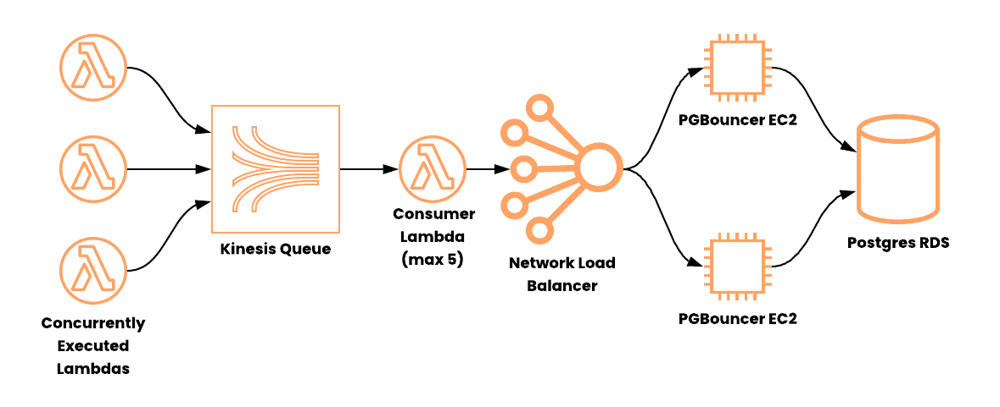

### Example 2
---
Shopify e-commerce platform offers services to online shops including tools for payment, marketing, shipping, and customer engagement. Rewind uses Shopify webhooks to provide automated backups of shops' data in "real-time" as customers make changes to their store’s products. This webhook traffic can sometimes burst because customers can generate tens of thousands of webhooks instantly - for example, when a new inventory is imported (a "products/update" webhook is POSTed) during a nightly bulk operation. Their solution implements a scalable architecture on AWS, utilizing a message queue to throttle the velocity of the webhook payloads before they hit the data store (17).

The examples described above demonstrate how bursty traffic patterns are generated through batch processes or resources being updated in bulk. While heavy inbound HTTP traffic can be alleviated by manually horizontally scaling application infrastructure, this is not a good way to handle bursty HTTP traffic because when enough server power to handle the traffic high water mark is provisioned and set up, these servers are sitting idle and mostly unused, waiting for the next burst of traffic.

 

## Need for a Framework {#need-for-a-framework}
---

The engineers at Jira and Rewind spent a not insignificant amount of time setting up cloud services to handle their webhook traffic.  While a serverless infrastructure offers a solution to this problem of bursty webhook traffic, another problem still remains: Developers should not have to spend their time setting up this scaffolding and learning the intricacies and gotchas of a cloud platform just to scale for webhooks. A framework is needed to streamline the system provisioning and deployment process.

Working within cloud platforms is not a trivial endeavor. Though AWS is the current industry leader in cloud computing, the complexity of AWS and its multitude of services means that the learning curve is steep to perform even simple tasks. Choreographing individual services to communicate and work in a coordinated way only compounds this problem. Each individual task performed on AWS might appear simple, however, they are usually comprised of several microtasks under the hood.

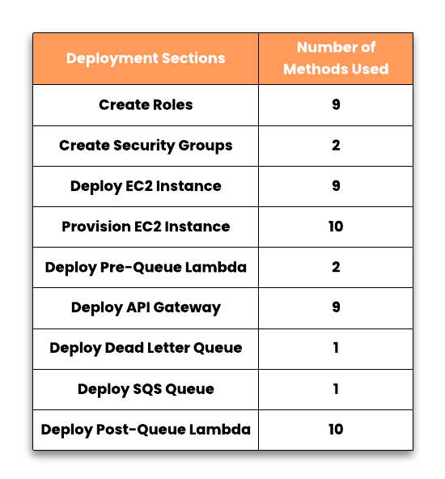

Nami solves this complexity problem with a simple command line interface; making it easy to deploy an AWS endpoint and quickly stand up a pipeline for webhook data that scales up and down to match traffic patterns, without any intervention required from the user. Nami enables the user to deploy with one command what would take over 50 separate AWS CLI or SDK calls to deploy, configure, and connect each piece of infrastructure. This pipeline, built using AWS services, serves to receive, acknowledge, process, and store payloads received from webhooks.

 

## Commands {#commands}
---

The following commands are used to deploy and interact with the Nami framework.

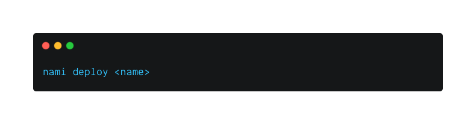

Running the `deploy` command sets up a new instance of Nami, including the following services:
- API Gateway endpoint unique to the <name> of the deployment,
- A pre-queue Lambda,
- A post-queue Lambda,
- An SQS queue,
- A Dead Letter Queue (DLQ), and
- An EC2 instance provisioned with MongoDB deployed via Docker
- Security groups for the post-queue Lambda and EC2 instance

Should the user want to add their own logic to the pre-queue and post-queue Lambda before an instance of the framework gets deployed, they can run the `create` command. When a user executes the `create` command, two directories are created; one with each of the pre-queue and post-queue Lambda files with the same logic as if they had executed the deploy command. The code can then be customized and deployed using `deploy`.

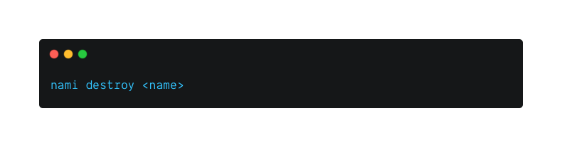

The `destroy` command will delete all of the resources unique to a particular <name>, including the API Gateway resource and endpoint (but not API Gateway itself), the two Lambda functions, the SQS queue and DLQ, and terminate the EC2 instance. The EBS volume will persist to allow the user to retrieve their data.

The user can run the `list` command to see a full list of active API endpoints for each instance of Nami.

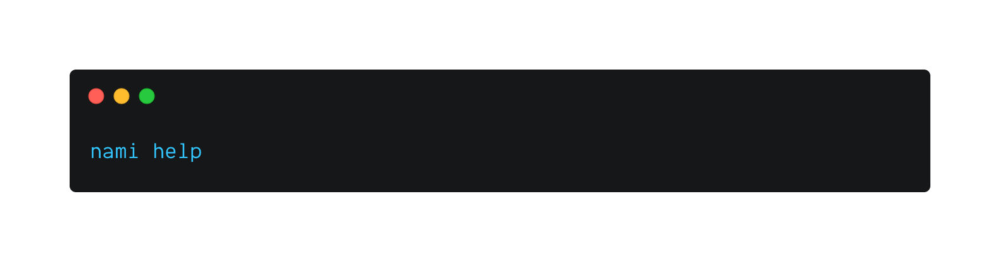

The user can run the `help` command to see documentation for all Nami commands.

 

## How it Works {#how-it-works}
---

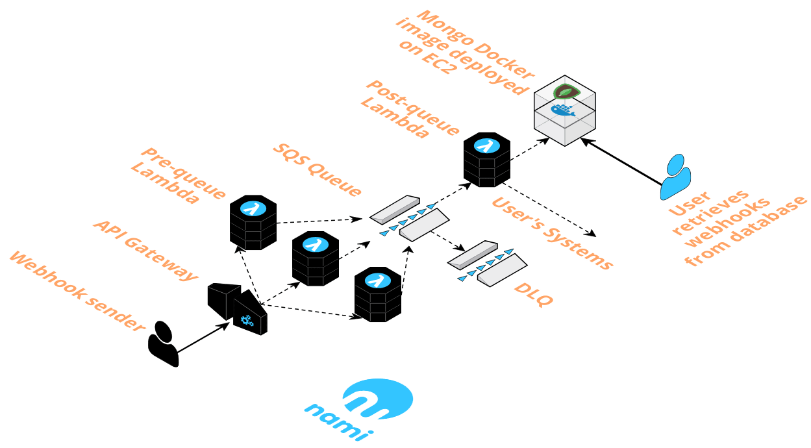

When the event producer makes a request, the API gateway is the first port of call. It accepts the request containing webhook event data, which is encapsulated as an event object, and triggers invocation of the pre-queue Lambda.

The function pushes the event object onto the SQS queue and responds to the webhook producer’s POST request with a 200 status code, if the function execution is successful.

As event data messages enter the queue, this triggers invocation of the post-queue Lambda, which consumes those messages at a stable rate.

The post-queue Lambda then opens a connection to the database, a MongoDB image deployed with Docker on EC2. The function code retrieves the payload from the event object and writes it to the database.

A successful write to the database causes the queue to delete the message. This process repeats until the queue is empty. If the write is unsuccessful, or the function execution fails for another reason, the queue will retry sending the message up to 5 times before sending it to a Dead Letter Queue (DLQ).

Event data in MongoDB is persisted on an EBS volume, AWS’ magnetic disk storage for EC2. The data is now at rest in the database and ready for the user to retrieve.

 

## Nami Framework Design Decisions {#nami-framework-design-decisions}
---

As we worked through engineering our solution, we considered tradeoffs to maximize scalability and minimize complexity for the user. Here we explore some of those tradeoffs and the design decisions made during development.

 

### Receiving and Acknowledging Webhook Data
---

 

#### Unreserved Concurrency for Maximum Scaling
---

AWS Lambda functions are an ideal tool with which to handle bursty traffic. Many Lambda functions can be invoked concurrently, where concurrent executions are the number of executions of a function’s code that are happening in parallel at any given time. Nami deploys two Lambda functions: a pre-queue Lambda and a post-queue Lambda. The pre-queue Lambda serves as the webhook receiver, the front facing function that ingests incoming webhook traffic. This core part of the architecture should be able to scale to its limit since we are relying on its elasticity to handle and respond to bursts of incoming requests. To enable this level of scaling, we configure the pre-queue Lambda function to use the AWS account level unreserved concurrency limit of 1000 concurrent Lambda functions. Although this number declines slightly after the post-queue Lambda is created and allocated 5 concurrent executions of its own, utilizing the unreserved concurrency pool will maximize scaling for the pre-queue Lambda function compared to reserving a specific function concurrency.

The following diagram depicts the scaling behavior of Lambda. Lambda functions are run in compute containers, with a single container able to handle multiple sequential executions for several hours. If all existing containers are currently executing functions when another request comes in, then another container must spin up to handle it. It is these multiple concurrent containers that enable parallel execution of functions. This is how Lambda scales horizontally.

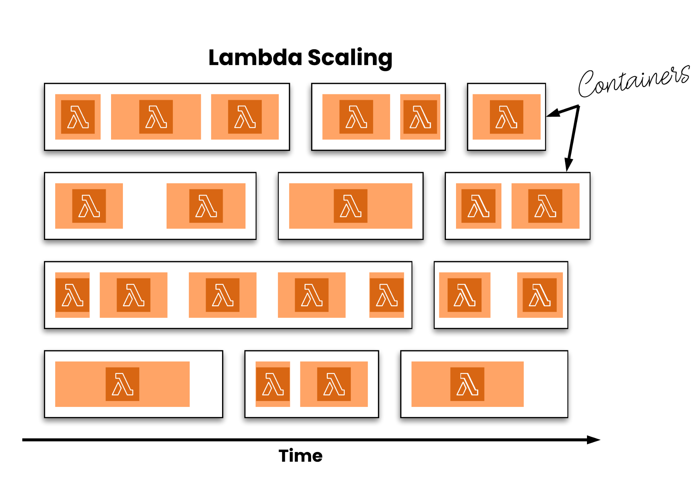

 

#### Execution Logic
---

In an event driven model, the event producer and consumer should not be aware of one another’s implementation. The consumer should simply receive the data, send it on for further processing, and then acknowledge receipt as quickly as possible. Therefore, the pre-queue Lambda function only receives the payload, enqueues it, and immediately returns a 200 success response to the sender. Additionally, the lean execution logic lowers latency, meaning that fewer containers are fired and thus less probability of reaching the concurrency limit. The user can also optionally add custom authentication logic to the function handler. Any kind of webhook event data processing is delegated to the post-queue Lambda, which reads the webhook payload from the Nami deployed queue.

 

#### Memory Allocation
---

During load testing, we aimed for a performance of around 5,000 requests per second (RPS) to compare with real world examples that solved bursty webhook traffic issues using a serverless architecture similar to Nami. We had found that increasing the function memory size to 256MB from a default of 128MB resulted in the best response times for this scenario, optimizing scaling power. An important consideration here is that provisioning any Lambda function with higher memory has a direct correlation with longer cold start times during the container initialization process. Despite this, function execution times were still well within tolerable levels for an expected webhook response time. When testing our system to determine how memory size would impact execution duration, we observed that increasing beyond 256MB yielded diminishing returns. With this decision, we traded lower cost of minimum memory and shorter cold start times for lower execution duration and greater scaling capacity. If a Nami user finds that a different memory setting is optimal for their customized implementation, they can easily adjust this setting from the AWS Lambda console.

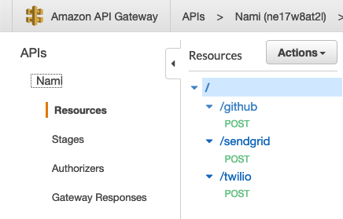

 

#### Multiple Framework Instances
---

We chose to support multiple instances of the framework where each instance is unique to an individual webhook subscription. Rather than deploying a new API Gateway endpoint for each instance, we consolidate user endpoints as child resources under the parent or root resource of the API Gateway so as not to strain the limit of individual API Gateways allowed on an account. Each time the user executes the deploy command to generate an additional API endpoint, a new resource is created that accepts webhook POST requests to the API Gateway. Each resource represents a unique API endpoint by appending the deployment <name> to the end of the `/nami` path on the same host.

 

### Message Queue
---

We connect the Lambda receiving webhook requests to the data store via an SQS queue as message broker, reinforcing our design in several ways.

 

#### Evening Out Traffic Spikes
---

Because the queue allows us to scale the producer and consumer separately, and allows us to have multiple consumer Lambdas, we have a different capacity for throughput on each side. When the producer is producing messages faster that the consumer can handle, the queue can buffer the messages until the consumer is ready to receive them.

An AWS SQS message queue is deployed in between the Lambda functions as a means to throttle the message flow, controlling the distribution of webhook data.  

Another downstream resource, which could become overwhelmed without the throttling mechanism of the queue, is the data store itself. Each second, thousands of consumer Lambda functions could be attempting connections to the EC2 instance, which will quickly become overloaded. While a larger instance size with more RAM could be used to support more incoming connections, we chose to keep costs lower with a smaller instance size as the queue’s throttling action is sufficient to keep the instance from being overwhelmed.

 

#### Decoupling
---

In the same way that the use of webhooks decouples event producer from event consumer, using the SQS queue at the center of our architecture decouples the pre-queue Lambda sending the message from the post-queue Lambda processing the message so that the producer does not need to have any awareness of the processing that the consumer is doing. We use the queue to ensure that producer and consumer can be developed independently.

 

#### Isolating Failure
---

Decoupling producer and consumer on the Nami data pipeline additionally provides some fault tolerance to the system. Should the EC2 instance ever be unavailable, the queue, or (in the event of extended unavailability) the DLQ, will retain the messages until the system is able to heal.

 

### Processing the Data
---

 

#### Reserved Concurrency for Throttling
---

When the post-queue Lambda function is invoked, it should provide throttling without generating errors while also maximizing concurrency available to the pre-queue Lambda function.  To achieve this, we limited the reserved concurrency of the post-queue Lambda function to allow only 5 concurrent invocations at one time, a minimum concurrency level recommended by AWS. This means that from the potential 1,000 concurrent executions available to any given AWS account, only a maximum of 5 will be allocated to the post-queue Lambda. This ensures the pre-queue Lambda function still has a large pool from which to draw, the SQS queue is drained at a steady rate, and the two Lambda functions are never competing for resources.

 

#### Batch Size
---

When messages are received from the queue by the post-queue Lambda, it is possible that the function execution can fail, even after a successful write to the database. This results in the message not being deleted from the queue. Another successful function execution can then result in duplicate entries in the database. This problem is compounded when there are multiple messages in a batch, because if a batch fails midway, all of the messages from the batch remain in the queue to be processed again. To reduce the impact of this potential issue, we chose to set the maximum batch size that the post-queue Lambda can process to 1. In this case, if a batch size of 1 is written to the data store multiple times, it is only one message that is duplicated. The downside of a batch size of 1 is more sends, however, we felt this was an acceptable trade-off given that the potential for event data duplication begins upstream, with the webhook producer, thus we chose to minimize this potential from within Nami.

 

#### User-Specific Logic
---

The post-queue Lambda function is the appropriate place to implement user-specific logic for data processing and/or sending the webhook payload to external systems. Performing data processing in this post-queue Lambda enables our system to maintain decoupling between webhook producer and consumer. Also, because the flow of webhooks has been slowed by the queue, we can do more “heavy lifting” with the data, as minimal execution durations are not critical to scaling as with the pre-queue Lambda.

 

#### Reusing Database Connections
---

We enabled the post-queue Lambda function to reuse database connections in order to both reduce the function’s execution duration, as well as efficiently use available database connections. This makes use of the Lambda container’s execution context, creating a closure around the database connection object, the value of which is accessible to all Lambda executions in the same container. If the connection does not exist, it is created and assigned to a variable in this context space for future Lambda executions to use.

While the function execution duration gains are minimal, this connection reuse plays a large role in allowing a relatively small EC2 instance size (t2.micro) to be used with Nami. Each open database connection uses an amount of memory, so the EC2 instance is only able to support up to certain number of connections. This implementation prioritizes efficient use of these connections.

 

#### Security
---

To ensure that the data store is not accessible from the public internet, the post-queue Lambda function and EC2 instance are both within their own Virtual Private Cloud (VPC) and security group. This restricts all incoming traffic beyond what is needed for the Lambda function to connect to the instance and write to the database.

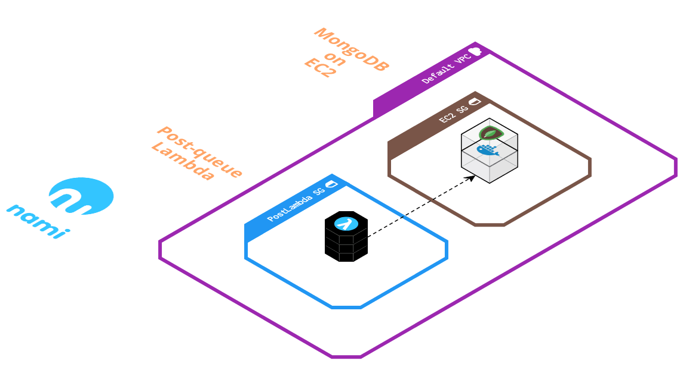

 

#### Handling Dropped Messages
---

To handle repeated failures of the post-queue Lambda trying to write to MongoDB, a second SQS queue is added to serve as a dead letter queue (DLQ) for the main queue. Any messages that fail to be written to the database 5 times (configurable) will be diverted here for the user to process manually instead of these messages being lost. The DLQ is set to the maximum message retention of 14 days, deliberately giving the user ample time to manually process any failed messages.

 

### Storing the Data
---

 

#### Deploying with Docker
---

Nami deploys a Docker container with MongoDB on an AWS EC2 instance to provide a stable destination for user’s data.  Deploying with Docker, as opposed to direct installation of MongoDB, is well suited to the use of an EC2 instance in our framework because it allows for deployment of the encapsulated container on any system. Containerization disassociates the application running inside it from host system configurations.  Once messages arrive, the post-queue Lambda functions can connect to the EC2 instance and write the webhook data to MongoDB for future retrieval.

 

#### Preserving Data during Downtime
---

One challenge with EC2 instances is that any data stored in memory is lost in the event that the instance stops running, or is terminated. To overcome this, Nami’s MongoDB container is pre-configured to store data on a persistent Elastic Block Store (EBS) volume rather than the ephemeral Docker container or EC2 instance itself. A specific filesystem mapping is declared during EC2 provisioning to initiate this change.  This ensures that webhook message data would persist if either of those went offline or were stopped or terminated.

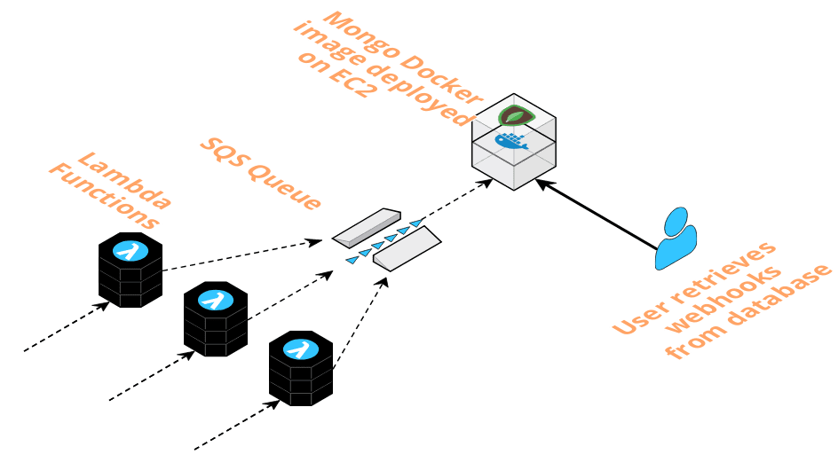

 

## Implementation Challenges {#implementation-challenges}
---

 

### AWS Optimistic Request Object
---

A challenge we faced with deploying or destroying multiple AWS components in rapid succession was dependency conflicts where one component relied on the other’s existence in order to be deployed, or a component could not be destroyed when another depended on it. Just using async/await syntax was not enough to overcome the problem of encountering these timing errors when attempting to deploy (or destroy) one component when its dependency was not yet resolved.

Errors like this occur because, when creating or deleting components via the AWS SDK, the request returns an AWS Request object for which the registered callback returns an optimistic success response. Despite awaiting each SDK call, the next asynchronous operation is performed upon receipt of an optimistic response, not when the component is actually prepared to accept the next operation.

In development, this latency was periodically throwing errors, both when deploying dependent resources and when destroying them. For example, after calling the `nami destroy` command, which terminates the EC2 instance associated with a resource, we received an error when trying to destroy the security group associated with it because the instance had not actually been terminated yet.

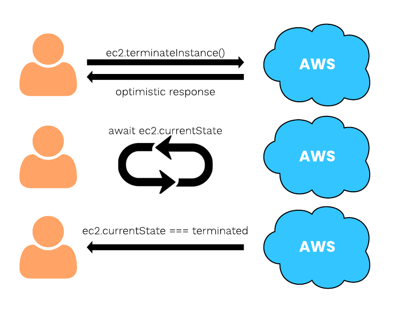

To overcome this, we implemented a simple while loop which used the AWS SDK to check the instance’s status code and only return from the function call after the instance is in the appropriate state.

 

### Automated Provisioning
---

The use of a Docker container on an EC2 instance presented a few challenges. How do we programmatically install the Docker container with appropriate port and volume mappings and database / collection creation when the EC2 instance is launched?

Nami automatically installs, configures, and runs both Docker and MongoDB by passing in a shell script that is automatically run when the EC2 instance is instantiated. This shell script performs the following operations:

- updates package database with `apt-get`
- installs Docker and the Docker CLI
- downloads and runs the MongoDB Docker image
- configures the MongoDB container to write to the EBS volume
- publishes the same port MongoDB uses to the Ubuntu host

Another question faced with running Docker on EC2 was - what happens if an EC2 instance were to temporarily stop running? Docker containers need to be `run` in order to be used, and they stop running when their host system stops running. To ensure that the container would always be available and running as long as the EC2 instance was on, we configure a restart policy per container `--restart=always` that ensures that our container will always be up and running when the EC2 instance is running.

 

### Limitations with Webhook Data {#limitations-with-webhook-data}
---

The nature of how webhook data is transmitted, beginning with the producer and then being piped through a serverless infrastructure, introduces a couple of variables that need to be considered to set expectations for how the data is delivered to and ultimately stored by the system.

 

#### Ordering
---

Ordering of messages can be important if event data that webhook messages contain triggers state changes. However, the order in which messages arrive in the database cannot be guaranteed by webhook providers (22).

Send failures, variable latencies, and implementation details can result in webhook data to be received out of order (8). HTTP requests can also be refused for a variety of reasons. If a webhook provider sends a request that the webhook consumer rejects, typically the provider will store the message and try again later, often multiple times per day until the message is finally accepted. This message, however, will now be out of order compared to other messages sent before the first message was finally accepted.

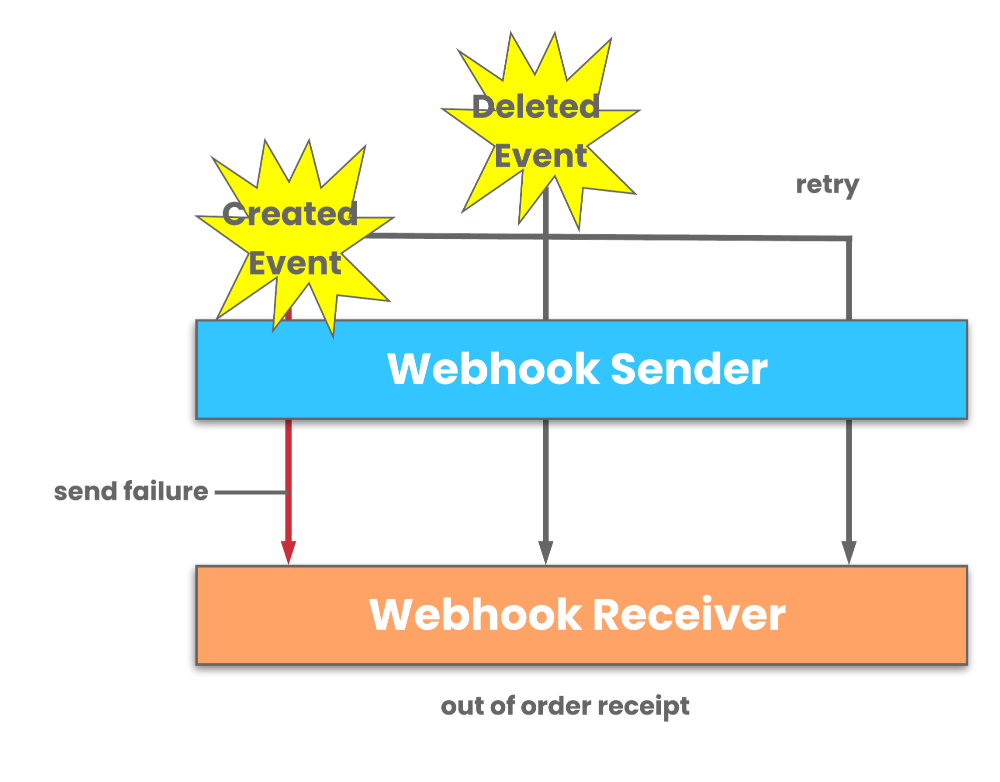

Also within the framework itself, the SQS message queue does not guarantee ordering. Messages can be removed from the queue in a different order than they were received. Additionally, retry attempts can contribute to messages being consumed out of order and further exacerbate the problem.

The user will need to sort webhook messages by timestamp or unique event id included in the payload by the webhook provider to restore ordering.

 

#### Duplication
---

Webhook producers warn consumers that endpoints may receive duplicate messages (22). In addition to that, a standard SQS queue deployed by Nami guarantees at least once message delivery. The consequence of this is that the same message could be delivered more than once, and the post-queue Lambda could process duplicate messages. Application code can help users identify duplicate webhook messages by filtering messages by timestamp or unique event id sent by the producer. Alternatively, the user’s application logic itself can be made idempotent so that it can handle duplicate messages without affecting the state of their system beyond the first receipt of the message.

 

## Load Testing
---

To observe performance under simulated bursty traffic, we load tested Nami to help identify possible bottlenecks and breakpoints for a given load, as well as to set operational bounds on our system.

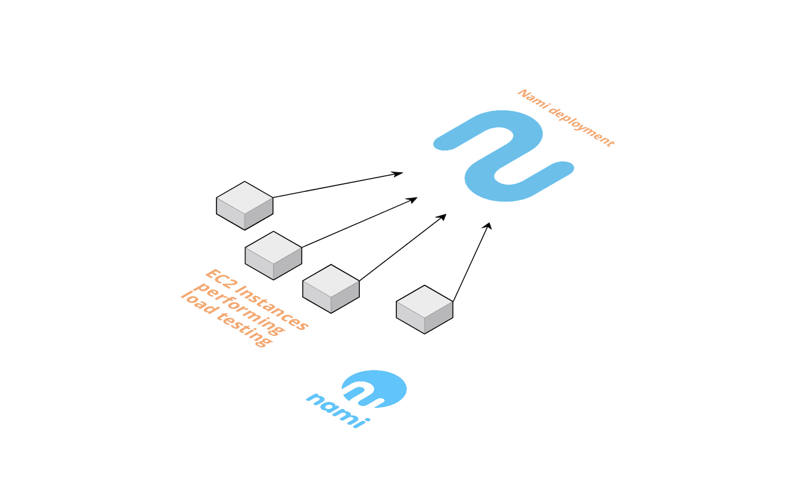

The primary feature of the architecture is its scalability, so RPS should give a good indication as to how the deployment scales. We used Apache Bench, with runs scheduled simultaneously from multiple EC2 instances, to send a number of HTTP POST requests to a Nami API endpoint. The tests then returned indicators for failed requests and the number of requests made per second. The system was able to respond successfully within tolerable response times, handling approximately 4,000 RPS with no errors generated, and up to 4,800 RPS with only 3 errors generated during this test. At a load of 4,800 RPS, Lambda concurrency reached 670 concurrent executions. These results demonstrate that Nami was able to consume the expected range of approximately 5,000 RPS that was seen in our real-world examples of a serverless webhook handling system.

 

## Future Plans {#future-plans}
---

Currently, there are several additional directions we would like to explore with the Nami framework.

 

### Greater Customization Options
---

While the user can currently customize any of the resources deployed using Nami via the AWS web console or the AWS CLI, we would like to expand Nami so that users can pass in flags during the `nami deploy <name>` command to customize their deployment. Some options that the user would ideally be able to configure include:

- an EC2 instance type
- an EBS volume size
- custom memory and timeout limits for Lambdas
- custom error handling/response codes
- custom queue message retention period

 

### Monitoring alerts
---

Currently the user needs to monitor the infrastructure set up by Nami to check if there are any errors or messages in the DLQ. We would like to implement CloudWatch alarms that would direct the user’s attention to any abnormal events in the system, allowing for manual intervention.

 

## About Us {#about-us}
---

  

    Our team of three software engineers collaborated remotely across North America and Europe to build Nami. Feel free to reach out to us if you have any questions about Nami or would like to discuss any of the topics mentioned in our write up.
  

  <ul>
    <li class="individual">
      
      <h3>Wendy Kuhn</h3>
      
Austin, TX

    </li>
    <li class="individual">
      
      <h3>Sachin Chandy</h3>
      
London, UK

    </li>
    <li class="individual">
      
      <h3>Nick Miller</h3>
      
Los Angeles, CA

    </li>
  </ul>

 

## References {#references}
---

1. https://www.amazon.com/Scalability-Startup-Engineers-Artur-Ejsmont/dp/0071843655
2. https://www.amazon.com/Designing-Data-Intensive-Applications-Reliable-Maintainable/dp/1449373321
3. https://www.manning.com/books/aws-lambda-in-action
4. https://www.jeremydaly.com/how-to-use-sns-and-sqs-to-distribute-and-throttle-events/
5. https://web.archive.org/web/20180120002912/http://www.progrium.com/blog/2007/05/03/web-hooks-to-revolutionize-the-web/
6. https://nordicapis.com/5-protocols-for-event-driven-api-architectures/
7. https://launchschool.com/books/working_with_apis/read
8. https://brandur.org/webhooks
9. https://en.wikipedia.org/wiki/Denial-of-service_attack
10. https://martinfowler.com/articles/serverless.html
11. https://aws.amazon.com/api-gateway/
12. https://docs.aws.amazon.com/lambda/latest/dg/concurrent-executions.html
13. https://docs.aws.amazon.com/lambda/latest/dg/scaling.html
14. https://aws.amazon.com/blogs/compute/managing-aws-lambda-function-concurrency/
15. https://winterwindsoftware.com/scaling-lambdas-inside-vpc/
16. https://blog.codebarrel.io/new-monitor-your-service-limits-automation-for-jira-performance-update-32525ec02711
17. https://rewind.io/blog/handle-shopify-webhooks-without-a-server/
18. https://www.slideshare.net/AmazonWebServices/best-practices-for-using-aws-lambda-with-rdsrdbms-solutions-srv320
19. https://en.wikipedia.org/wiki/Docker_(software)
20. https://en.wikipedia.org/wiki/Webhook
21. https://www.manning.com/books/serverless-architectures-on-aws
